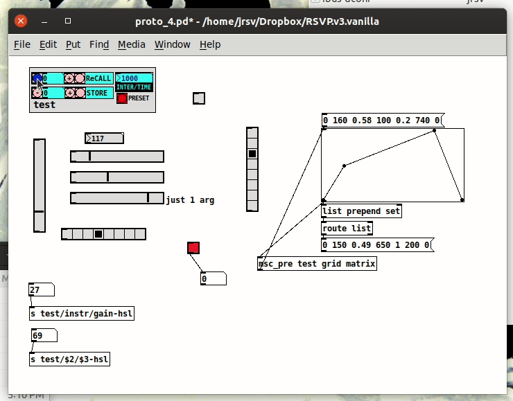

# RSVP [Répondez S’il Vous Plaît - (R)afael (S)ubía (V)aldez (P)resets] 
State Saving System for Pure Data

RSVP is a state saving system for Pure Data (http://puredata.info/). It was created to offer Pure Data users a way to record presets for the GUI objects inside patches.

RSVP stands for two things Répondez S’il Vous Plaît and my initials Rafael Subía Valdez Presets. The goal of an RSVP invitation, is to confirm assistance to an event, effectively reserving a place to that event. This translated to the preset system is a space and time "reserved" for a certain value.

This version of RSVP is completely developed with Pure Data vanilla 0.50 which makes the system more robust by dropping all third party dependencies. Like previous versions of RSVP, the library is a collection of abstractions that wrap around Pure Data's own GUI. The [msc_pre] object can be used to store states from none vanilla objects. 

The system is designed to use the abstractions as templates to modify and create personalized GUIs. More explanation and tutorials to come.

# HISTORY
## Beginning
### Version 1
RSVP was developed in 2016 when working on my PhD at The University of Edinburgh. Initially it was designed to simplify state saving in Pure Data as an alternative to more extensive State Saving methods like "Kollabs". The first version of RSVP made use of planty of externals and libraries from the Pure Data community. This made RSVP easier to use, but increased its dependence of external code. The saving and recalling mechanism was complex and made use of the [coll] object avialable in the "Cyclone" library. Its development started with Pure Data 0.46 which did not include the now used text object. This version of RSVP was presented in the LAC2018 - Berlin.

# IMPORTANT 
## (RSVP breaks backwards compatability)
Because RSVP is designed as a local library, it is better to leave projects done with previous versions with their own local version. 

